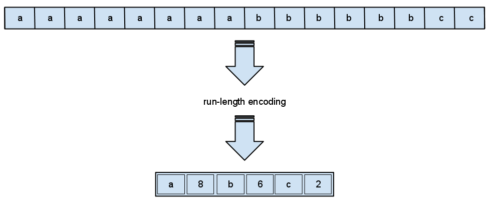

Vertica is a distributed SQL database used for data warehousing and analytics. In this article I will go over the basic concepts needed to effectively design schemas and queries.

Records in Vertica are stored in columnar order, rather than row order like in OLTP databses such as MySQL and PostgreSQL. This allows for massively parrallel processing, as well as highly encodable and compressible data. Vertical storage is a common feature among most major data wharehouse technologies like BigQuery and RedShift. 

One advantage is being able to have "wide" tables with many columns, without impactings performance. In a row order database, adding a column locks the table during the alter and will hurt performance of preexisting queries because it increases the amount of memory each row takes up. With larger rows that means there are less rows per page and it will take longer to paginate through the rows when doing a lookup. 

For a column order database adding columns is instaneous and has no impact on performance. Wide tables are helpful in analytics especially when creating [tidy data](https://en.wikipedia.org/wiki/Tidy_data). It also allows for quick prototyping and deployment of new tables or altering existing tables. Data analysis tends to be an adhoc process with fast changing requirements, so its important to give yourself the flexibility to chagne your data model. 

## Massively Parallel Processing

Vertica is designed to run in a cluster of nodes. The nodes have a shared nothing architecture meaning each node has its own hardware resources and the nodes communicate over the internet. Being distributed also makes it highly available and scalable, with the ability to add or subtract nodes. This comes at the cost of consistency, any change must be propagated across all the nodes. For this reason, Vertica cannot efficiently update a large volume of rows. 

Vertica is designed to do fact table to dimension table joins. A fact table is a large table that is append-only, like an event log. While a dimension table is a smaller table that is used to provide a description. For example, let's say the transaction fact table contains a product code, we could have a product dimension table that contains the product type, description, and other details. If we want to add more information about a product we can do so by adding it to the dimension table. Fact tables are designed to be immutable as modifying records is expensive. The dimension tables are replicated across each node, so that joins can be done locally on each node. 

When designed correctly, Vertica will perform a join locally on each node then collate the responses at the end.


## Projections

In Vertica Projections are what is stored in the physical storage layer. They are analogous to tables in other SQL databases, with similar features like strongly typed columns and uniqueness constraints. A projection can contain a set of columns from multiple tables like a materialized view. Every projection stores a separate copy of the data. One projection can contain a subset of another projection, but with a different segmentation and sorting order.

Every table has a super projection containing all the columns of a logical table. You can create a projection optimized for a specific query. Projections offer high availability via buddy projections which are copies of the same projection, but the columns are stored on different nodes to create redundancy. Another added benefit is that if a node goes down the buddy projections allow Vertica to continue functions. 

Since every projection stores a complete copy of the data, mutating a projection will result in all of the buddy projections and derivative projections being mutated as well. Bad performance on delete operations has the potential to slow down the whole cluster through cascading projections.

## Segmentation

Segmentation is where the data is stored. For large tables, the goal is to evenly distribute the data across the cluster for parallel query execution to avoid shuffling. This is done by using a hash key on a unique identifier like a user_id, a hash key can contain multiple columns. If records need to be shuffled between nodes for a join you will see `GLOBAL RESEGMENT GROUPS` in the query plan. This is a hint that segmentation is a possible way to improve performance.

For small dimension tables you want it to be replicated across all nodes. To do this you mark the table as `UNSEGMENTED ALL NODES` this will create a copy of the table in each node in the cluster. This will allow the each node to load the table into memory for quick hash joins.

```sql
-- fact table of transactions
CREATE TABLE transactions (
    transaction_id INT NOT NULL,
    user_id INT NOT NULL,
    product_id INT NOT NULL,
    quantity INT NOT NULL,
    vendor VARCHAR(255) NOT NULL,
    dollar_amount NUMERIC  NOT NULL,
    execution_timestamp TIMESTAMPTZ
) -- sort columns are ordered by cardinality and based on user queries
  ORDER BY vendor, product_id, user_id -- highlight-line
  SEGMENTED BY HASH(user_id) ALL NODES -- highlight-line
;

-- dimension table containing information about products
CREATE TABLE products (
   product_id INT NOT NULL,
   product_type INT NOT NULL,
   product_description VARCHAR(1000) NOT NULL
) ORDER BY product_type, product_id  -- highlight-line
  UNSEGMENTED ALL NODES              -- highlight-line
;
```

When two tables share the same segmentation key it allows for a `PIPED MERGE`. Wheny you see this in the query plan you know that the joins are being performed on each node without shuffling. If you see `GLOBAL RESEGMENT GROUPS` on a slow query, then consider refactoring your segmentation to avoid shuffling. 

[#TODO: need to fact checkt his]

## Sorting and Cardinality

The sort order determines how the data is stored on disk. This is the primary way query performance is optimized. The order by clause determines the sort order. The goal is to use columns that get used in join, where, and group by clauses. 

Because the data is stored in column arrays, that allows Vertica to use typed arrays. Typed arrays are highly compressible and encodeable since they are homogenous in nature. An advantage of encoding is that data does not have to be decoded to be processed, the smaller footprint of decoded data helps reduce IO across the network and disk. 

The sort order functions analogously to an index in another database. Say for example you had a table that contained addresses with a field for state. If I write a query that selects users that live in California, Vertica only has to scan users where the state is California. Because the data is ordered, Vertica can quickly find California while avoiding a scan of all the other states. This kind of filtering is what leads to very fast queries on large amounts of data. 

Using a sort column in a join allows a merge join, a special optimized type of join that works by using two pointers on two sorted lists. When used correctly with segmentation a merge join allows records to be quickly joined on a node without any shuffling.

One of the options for compression is Run Length Encoding, which works well on low cardinality data. Run Length Encoding (RLE) works by sorting the data then taking the counts of each value. Rather than storing each individual value it stores the counts for each unique value. When you include a column with RLE in the where clause Vertica will do a predicate push down and only access the values you want excluding the rest.When used in a where clause it allows the query optimizer to scan only a fraction of the rows, making the query more selective and much faster.



When a column with RLE is used in a group by clause, assuming there aren’t too many groups, then the optimizer can process each group more quickly. Because the data for a single group are colocated in the same block of memory.

A heuristic used for designing sort order is to use columns in ascending cardinliaty. It is a similar priniciple to a [Huffman Encoding](Link needed) where data is stored in a hierachical data structure optimized for fast access. 


## Conclusion

Keeping the techniques mentioned here in mind is useful for speeding up the performance of any slow query and designing tables. I have seen improvements of 5x to 500x speedups just by adding segmentation or changing the sort order. If something is running really slowly it’s likely there are some opportunities to improve it. 

When working with column order databases it requires a separate mindset. A production OLTP databse must be optimized for fast performance to support the customer facing production application. This means using normalization to make your database if ast. 

On the other hand, a data wharehouse is optimized for ease of use and clarity of analysis. De-normalization is helpful in that it makes the relationship betweem objects self evident and encapsulated within the data model itself. While writing analytics queries the fewer joins the better, as every join is an opportunity to introduce erroneous duplication. 

It is easy to forget that Vertica works entirely differently than a conventional SQL database. The fact that it uses SQL gives the false impression that you can simply work with the same mental models. In order to really get the most performance out keep in mind that Vertica is a columnar database, that utilizes segmentation and sort order to achieve massive data scaling.
